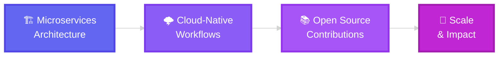

<div align="center">


<br>

[](mailto:ravindersingh74123@gmail.com)
[](tel:+919729941863)
[](https://github.com/ravindersingh74123)
[](https://leetcode.com/)
[](https://linkedin.com/)


</div>

<br>

##  About Me


```typescript
const ravinder = {
    🎓 education: "B.E. CS @ Thapar Institute",
    📍 location: "Patiala, Punjab, India",
    💼 experience: [
        "Web Dev Intern @ Mentor Coder",
        "Project Intern @ Thapar ELC"
    ],
    🎯 focus: [
        "System Design",
        "Cloud Architecture", 
        "Real-time Systems",
        "Developer Tooling"
    ],
    🚀 currentlyExploring: [
        "Kafka & Event Streaming",
        "Distributed Computing",
        "Microservices Architecture"
    ],
    💡 philosophy: "Build → Break → Learn → Repeat",
    ⚡ funFact: "400+ problems solved on LeetCode 🔥"
};
```

<br clear="right"/>

### 🎯 What I'm Building

<table>
<tr>
<td width="50%" valign="top">

#### 🔥 Current Focus
- 🏗️ Designing **scalable SaaS platforms**
- ⚡ Building **real-time automation systems**
- 🌩️ Exploring **cloud-native architectures**
- 🔄 Implementing **event-driven workflows**

</td>
<td width="50%" valign="top">

#### 🎓 Learning & Growing
- 📚 Mastering **distributed systems**
- 🔐 Enhancing **system security**
- 🚀 Optimizing for **performance**
- 🤝 Contributing to **open source**

</td>
</tr>
</table>

<br>


##  Tech Arsenal

<div align="center">

### 💻 Languages


### 🎨 Frontend Development


### ⚙️ Backend Development


### 🗄️ Databases & Caching


### ☁️ DevOps & Cloud


</div>

<br>


##  Featured Projects

<div align="center">

<table>
<tr>
<td width="50%" valign="top">

### 🔄 Workflow Automation System
   

**Zapier-style automation engine** 🚀

✨ Build custom trigger-action pipelines  
⚡ Real-time event propagation with Kafka  
🔧 Modular architecture for reusable logic  
🛡️ Built-in failure recovery & retries  
📊 Handles thousands of concurrent workflows

[](https://github.com/ravindersingh74123)

</td>
<td width="50%" valign="top">

### ⚡ Remote Code Execution System
   

**Secure online code judge** 🔒

🌐 Multi-language support  
🐳 Sandboxed Docker environments  
⚙️ Async test evaluation system  
📝 Problem templates with boilerplate  
🎯 Real-time feedback mechanisms

[](https://github.com/ravindersingh74123)

</td>
</tr>

<tr>
<td width="50%" valign="top">

### 💳 PaySwift
   

**Complete payment gateway** 💰

🔄 Real-time webhook callbacks  
🔁 Intelligent retry logic  
📋 End-to-end transaction logging  
🛡️ Idempotent API routes  
☁️ Cloud-deployed architecture

[](https://github.com/ravindersingh74123)

</td>
<td width="50%" valign="top">

### 📹 Video Call Application
   

**Real-time video conferencing** 🎥

📡 WebRTC peer-to-peer connections  
💬 Live chat & screen sharing  
🔊 High-quality audio/video streaming  
👥 Multi-participant support  
🔐 Secure signaling server

[](https://github.com/ravindersingh74123)

</td>
</tr>
</table>

</div>

<br>


## 📊 GitHub Statistics

<div align="center">
  
  
</div>

<div align="center">
  
</div>

<br>

<div align="center">
  
</div>

<br>

### 📈 Contribution Graph

<div align="center">
  
</div>

<br>


## 🏆 Achievements & Certifications

<div align="center">

| 🎯 Achievement | 📋 Details |
|---------------|-----------|
| 💻 **100xDevs Full-Stack** | Completed comprehensive web development bootcamp |
| 🧠 **LeetCode Warrior** | 400+ problems solved • 80+ day streak 🔥 |
| ☁️ **AWS Academy** | Cloud Foundations & Cloud Developing certified |
| 🏢 **Professional Experience** | Web Dev Intern @ Mentor Coder • Built School ERP platform |
| 🔬 **Research Project** | Radar-based speed detection with YOLOv5 @ Thapar ELC |

</div>

<br>


## 🧠 Coding Profiles

<div align="center">

[](https://leetcode.com/)
[](https://geeksforgeeks.org/)
[](https://codeforces.com/)

</div>

<br>


## 🎯 2025 Roadmap

<div align="center">



</div>

<table align="center">
<tr>
<td width="50%" valign="top">

### 🎯 Short-term Goals (Q1-Q2 2025)
- ✅ Build production-ready microservices
- ✅ Master Kubernetes & container orchestration
- ✅ Contribute to 5+ open-source projects
- ✅ Write technical blogs & tutorials

</td>
<td width="50%" valign="top">

### 🚀 Long-term Vision (2025)
- ✅ Architect scalable cloud solutions
- ✅ Lead complex system design initiatives
- ✅ Mentor aspiring developers
- ✅ Build products that impact millions

</td>
</tr>
</table>

<br>


<div align="center">

## 💭 Developer Philosophy


<br><br>

### 🤝 Let's Connect & Build Together!


**Interested in:** System Design • Cloud Architecture • Real-time Systems • Developer Tooling

<br>


<br><br>


### 🌟 Thanks for visiting! Let's build something amazing together! 🚀

<br>

**⭐ From [ravindersingh74123](https://github.com/ravindersingh74123) • Made with 💙 and lots of ☕**

<br>

</div>


